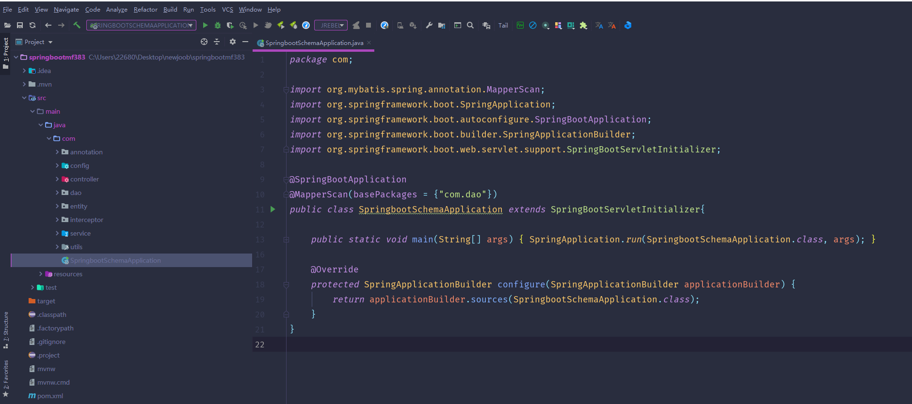
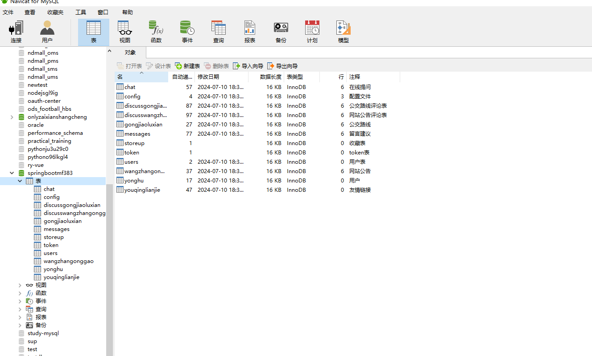
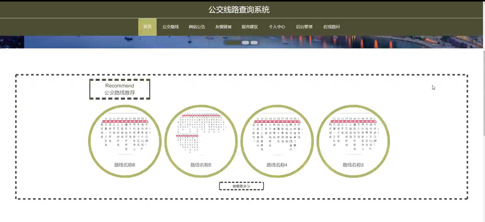
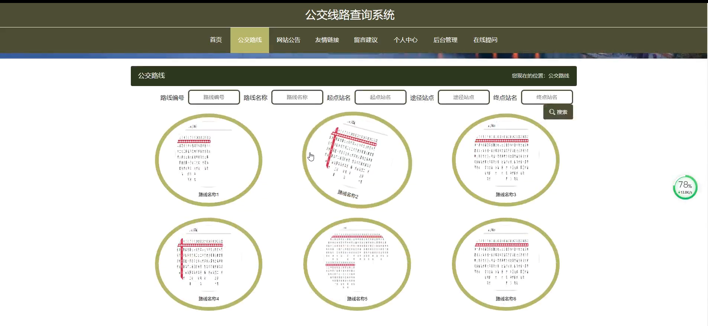
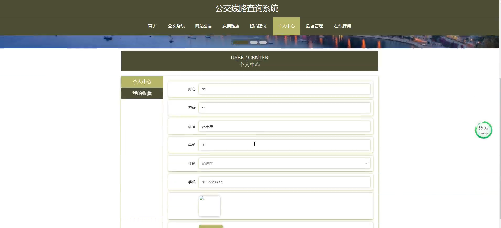
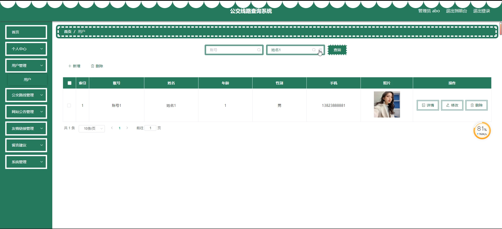
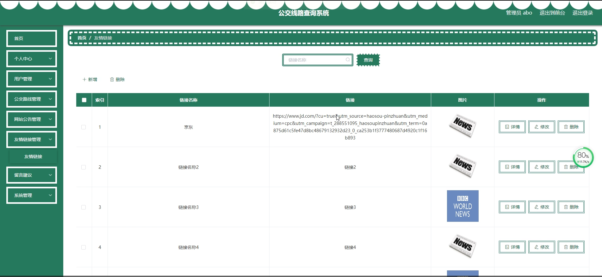
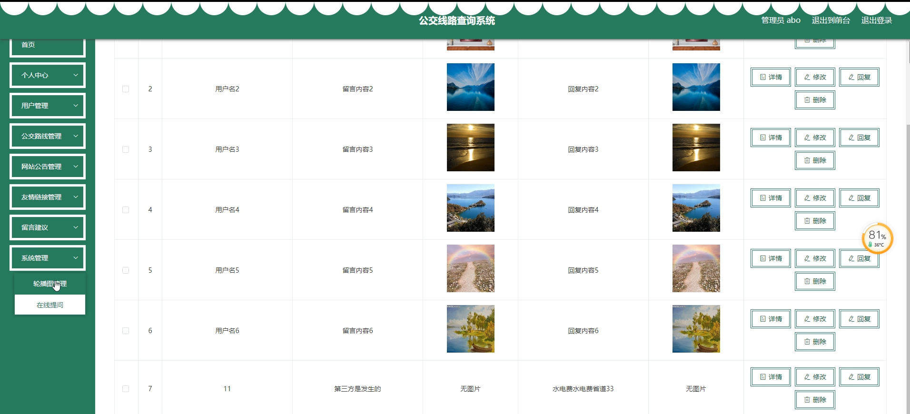

# 基于springboot的公交线路查询系统

<h4 style='color:red'>联系不到我，就看我的主页 </h4> 
 
#### 介绍

在城市交通日益复杂的背景下，为了方便市民出行，提高公共交通的利用率，我们开发了这个基于 Spring Boot 的公交线路查询系统。该系统旨在为用户提供准确、实时、便捷的公交线路信息查询服务，同时为管理员提供有效的管理工具，以保障系统的稳定运行和数据的及时更新。

#### 技术栈

后端技术栈：Springboot+Mysql+Maven

前端技术栈：Vue+Html+Css+Javascript+ElementUI

开发工具：Idea+Vscode+Navicate

#### 系统功能介绍

（一）管理员角色  
个人中心：管理员可以在此查看和修改个人信息，接收系统通知和重要消息。  
用户管理：对系统用户进行管理，包括用户信息的查看、修改、删除，以及用户权限的设置。  
公交路线管理：负责添加、修改、删除公交线路的信息，包括线路名称、起点和终点、途经站点、运营时间、票价等。  
网站公告管理：发布与公交线路调整、公交服务变更、特殊天气影响等相关的公告信息，确保用户及时了解重要动态。  
友情链接管理：审核和管理与公交出行相关的友情链接，如公交卡充值网站、城市交通规划网站等，为用户提供更多的相关资源。  
留言建议：查看用户的留言和建议，及时回复并处理，以不断改进系统服务。  
系统管理：进行系统的参数设置、数据备份与恢复、日志管理等操作，保障系统的稳定运行和数据安全。  

（二）用户角色  
公交路线：输入起点和终点，查询可行的公交线路、换乘方案、预计行程时间等信息。  
网站公告：及时获取公交线路的变更、临时调整、优惠活动等重要通知。  
友情链接：访问与公交出行相关的有用链接，获取更多辅助信息。  
留言建议：向管理员提出关于公交线路优化、系统功能改进等方面的建议和意见。  
个人中心：修改个人资料、查看查询历史和收藏的线路。  
后台管理：管理自己的留言和建议记录。  
在线提问：针对公交线路的疑问向管理员或其他用户发起实时提问，并得到解答。  

#### 系统作用

方便市民出行  
为用户提供准确的公交线路信息，帮助规划出行路线，节省出行时间。  
提高公交服务质量  
管理员可以根据用户的反馈和实际运营情况，优化公交线路和服务。  
促进城市交通发展  
鼓励更多市民选择公交出行，减少私人车辆使用，缓解交通拥堵，降低环境污染。  
增强信息透明度  
及时公布公交相关信息，让市民了解公交运营动态，增强对公交系统的信任。  

#### 系统功能截图

代码结构

数据库表

登录

前台页面首页

公交路线

网站公告

个人中心

留言建议

管理员端用户管理

公交路线管理

友情链接

系统管理

在线提问

用户端后台管理

#### 总结

基于 Spring Boot 的公交线路查询系统，通过管理员和用户的不同功能模块，实现了公交线路信息的有效管理和便捷查询。管理员能够保障系统数据的准确性和及时性，用户能够轻松获取所需的公交出行信息。该系统有助于提升城市公共交通的服务水平，为市民创造更加便捷、高效的出行环境。

#### 使用说明

创建数据库，执行数据库脚本 修改jdbc数据库连接参数 下载安装maven依赖jar 启动idea中的springboot项目

后台地址：http://localhost:8080/springbootmf383/admin/dist/index.html

管理员  abo 密码 abo

前台地址：http://localhost:8080/springbootmf383/front/index.html